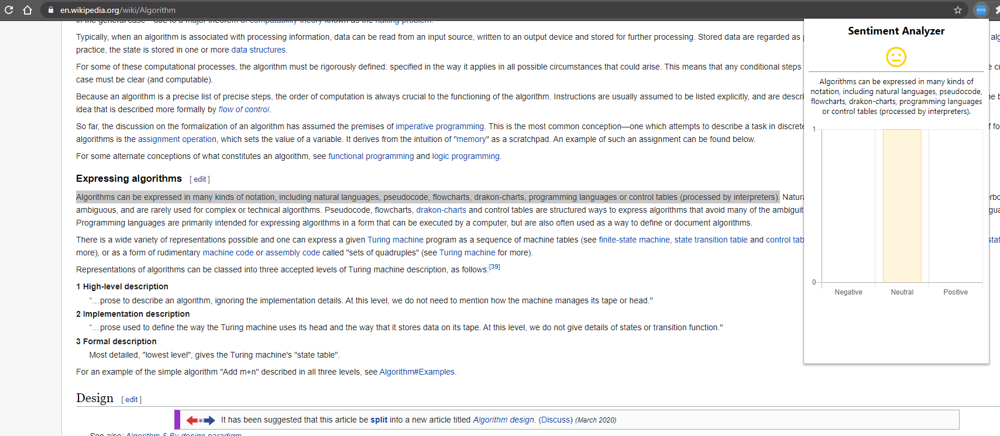

# Sentiment Analyzer

A Google Chrome Extension that gives a streamlined analysis of the positivity rating of selected text.

## Overview

Utilizes Google Cloud Platform's natural language processing API. Built in only 12 hours during Cutiehack 2019.

## Built With

- JQuery
- Chart.js
- Angular
- CSS
- HTML

## Future Developments

I would like to take this technology and make it a more useful by automatically finding the sentiment of things like reviews and showing it to the user.
